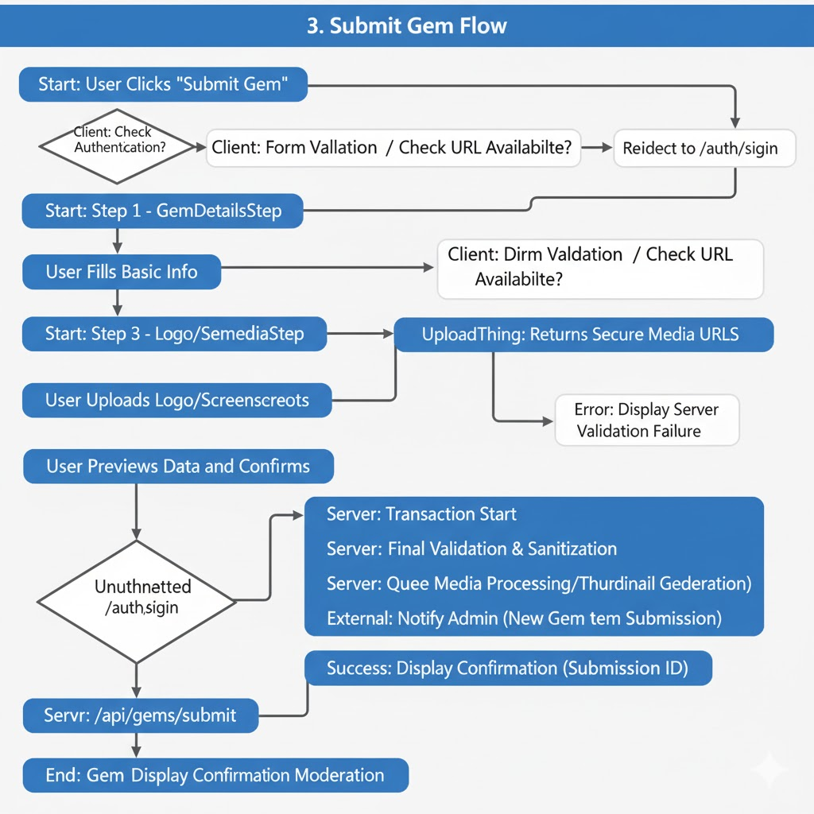
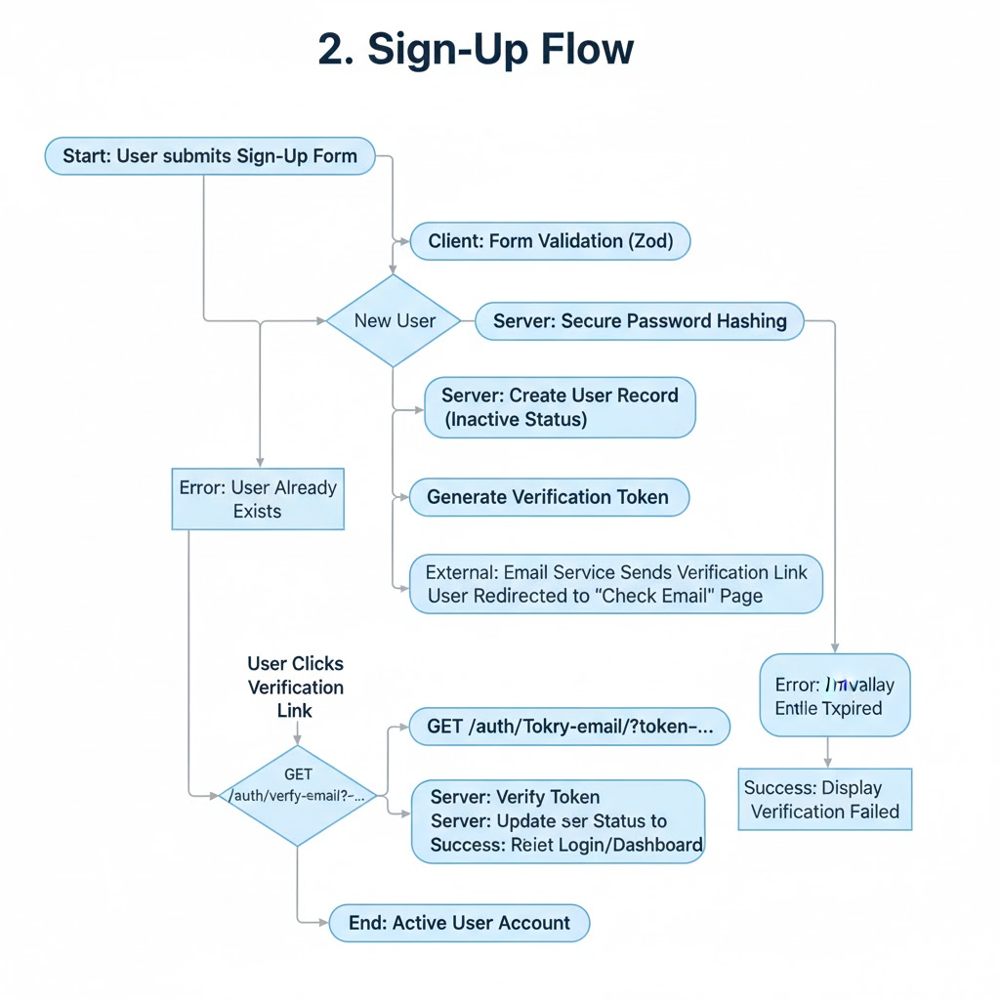

# Gems of India - Low Level Design

## Table of Contents

1. [Project Structure](#project-structure)
2. [Core Modules](#core-modules)
3. [Component Architecture](#component-architecture)
4. [Data Layer](#data-layer)
5. [Authentication Flow](#authentication-flow)
6. [API Implementation](#api-implementation)
7. [State Management](#state-management)
8. [UI/UX Implementation](#uiux-implementation)
9. [Performance Considerations](#performance-considerations)
10. [Testing Strategy](#testing-strategy)

## Project Structure

```
gems-of-india/
├── app/                      # Next.js app directory (App Router)
│   ├── (auth)/               # Authentication routes
│   ├── (entities)/           # Entity-related routes
│   ├── api/                  # API routes
│   ├── dashboard/            # User dashboard
│   └── admin/                # Admin interface
├── components/               # Reusable UI components
│   ├── auth/                 # Auth-related components
│   ├── entities/             # Entity display components
│   ├── forms/                # Form components
│   └── ui/                   # Base UI components
├── lib/                      # Shared utilities and helpers
│   ├── auth/                 # Authentication utilities
│   ├── db/                   # Database utilities
│   └── utils/                # General utilities
├── drizzle/                  # Database schema and migrations
│   ├── migrations/           # Database migrations
│   └── schema.ts             # Database schema definitions
├── public/                   # Static assets
└── types/                    # TypeScript type definitions
```

## Core Modules

> ### 1. Authentication Module

- **Components**: `AuthForm`, `SocialAuthButtons`, `ProtectedRoute`
- **Hooks**: `useSession`, `useAuth`
- **Utils**: `auth-options.ts`, `auth.ts`
- **Features**:
  - Email/Password authentication
  - OAuth providers (Google, GitHub)
  - Session management
  - Protected routes


> ### 2. Entity Module

- **Components**: `EntityCard`, `EntityList`, `EntityForm`
- **Hooks**: `useEntities`, `useEntity`
- **API Routes**: `GET /api/entities`, `POST /api/entities`, `GET /api/entities/[id]`
- **Features**:
  - CRUD operations for entities
  - Entity search and filtering
  - Entity relationships

> ### 3. Review System

- **Components**: `ReviewForm`, `ReviewList`, `Rating`
- **Hooks**: `useReviews`, `useCreateReview`
- **API Routes**: `POST /api/reviews`, `GET /api/reviews/[entityId]`
- **Features**:
  - Star ratings
  - Text reviews
  - Review moderation

> ### 4. Submit Gem Flow

- **Components**:
  - `GemSubmissionForm`: Main form component
  - `GemDetailsStep`: Basic information collection
  - `GemMediaStep`: Image/video uploads
  - `GemVerificationStep`: Submission verification
  - `SubmissionSuccess`: Success confirmation

  

- **Hooks**:
  - `useGemSubmission`: Manages form state and submission
  - `useGemValidation`: Handles form validation
  - `useUploadMedia`: Manages media uploads

- **API Endpoints**:
  - `POST` = `/api/gems/submit`: Submit new gem
  - `POST` = `/api/gems/upload-media`: Handle media uploads
  - `GET` = `/api/gems/check-availability`: Check gem name/URL availability

- **Flow Steps**:
  1. **User Authentication**
     - Verify user is logged in
     - Redirect to sign-in if not authenticated
  2. **Basic Information**
     - Gem name/title
     - Description (Markdown supported)
     - Category selection
     - Tags/keywords
     - Website/Repository URL
     - License information
  3. **Media Upload**
     - Logo/icon upload
     - Screenshots/gallery
     - Video demo (optional)
     - Media validation (size, format, dimensions)
  4. **Verification**
     - Preview of the gem listing
     - Edit options
     - Submission confirmation
  5. **Submission**
     - API call to save gem data
     - Media processing queue
     - Email notification to submitter
     - Admin notification for moderation

- **Validation Rules**:
  - Required fields
  - URL format validation
  - Media type/size restrictions
  - Duplicate detection
  - Spam prevention (rate limiting)

- **Error Handling**:
  - Form validation errors
  - Upload failures
  - Network issues
  - Server-side validation errors

- **Success Flow**:
  - Show success message
  - Provide submission reference ID
  - Option to view submission status
  - Link to user's dashboard

## Component Architecture

> ### 1. Layout Components

- `MainLayout`: Base layout with header and footer
- `DashboardLayout`: Layout for authenticated user dashboard
- `AdminLayout`: Layout for admin interface

> ### 2. Form Components

- `FormInput`: Reusable form input with validation
- `FormSelect`: Dropdown select component
- `FormTextarea`: Multi-line text input
- `FormError`: Displays form validation errors

> ### 3. UI Components

- `Button`: Custom button component with variants
- `Card`: Card container component
- `Modal`: Reusable modal dialog
- `Toast`: Notification system

## Data Layer

> ### 1. Database Schema

- **Users**: User accounts and profiles
- **Entities**: Main content items
- **Reviews**: User reviews of entities
- **Categories**: Entity categorization
- **Tags**: Entity tagging system

> ### 2. Data Fetching

- Server Components for initial data loading
- React Query for client-side data fetching and caching
- SWR for real-time data synchronization

> ### 3. State Management

- React Context for global state
- URL search params for filter state
- Local storage for user preferences

## Authentication Flow

> 1. **Sign In**

- User enters credentials/clicks OAuth provider
- Server validates credentials
- Session cookie is set
- User is redirected to dashboard


> 2. **Sign Up**

- User submits registration form
- Account is created
- Verification email is sent
- User verifies email to activate account



> 3. **Session Management**

- JWT-based session tokens
- Automatic token refresh
- Protected route handling

## API Implementation


> ### 1. RESTful Endpoints

- `GET /api/entities`: List entities with filtering
- `POST /api/entities`: Create new entity
- `GET /api/entities/[id]`: Get entity details
- `PUT /api/entities/[id]`: Update entity
- `DELETE /api/entities/[id]`: Delete entity

> ### 2. Authentication Middleware

- JWT verification
- Role-based access control
- Rate limiting

## Performance Considerations

> ### 1. Client-Side

- Code splitting with dynamic imports
- Image optimization with Next/Image
- Lazy loading for below-the-fold content

> ### 2. Server-Side

- Edge caching for static content
- Database query optimization
- API response caching

> ### 3. Build Optimizations

- Tree shaking
- Minification
- Bundle analysis

## Testing Strategy

> ### 1. Unit Tests

- Component rendering
- Utility functions
- Data transformation

> ### 2. Integration Tests

- API routes
- Authentication flows
- Form submissions

> ### 3. End-to-End Tests

- Critical user journeys
- Cross-browser testing
- Performance testing

> ### 4. Testing Tools

- Jest for unit tests
- React Testing Library for component tests
- Cypress for E2E tests
- Storybook for component development

## Deployment

> ### 1. Build Process

- Type checking
- Linting
- Testing
- Build optimization

> ### 2. Environment Variables

- Development
- Staging
- Production

> ### 3. Monitoring

- Error tracking
- Performance monitoring
- Usage analytics

## Security Considerations

> ### 1. Authentication

- Secure password hashing
- CSRF protection
- Rate limiting

> ### 2. Data Protection

- Input validation
- Output encoding
- SQL injection prevention

> ### 3. API Security

- HTTPS enforcement
- CORS configuration
- Request validation
